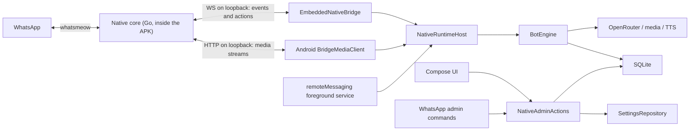

# Architecture

This document describes the source as it actually stands. It deliberately
separates implemented code, local test evidence, and evidence that still has to
come from a live run.

## System boundary

This port is not an Android wrapper around the old Node bot. The bot logic runs
natively in Kotlin, and the WhatsApp connection runs in the bundled Go core
(`nativewa.aar`, whatsmeow).

The APK is standalone. Everything runs on the phone. Bot logic, persistence,
settings, admin, the background service and the WhatsApp linked-device session
need no second host. The core binds its authenticated server exclusively to
`127.0.0.1:18787`, and there is no outbound connection except to WhatsApp and
OpenRouter.



### What Android owns

- runtime and bot behaviour, prompt assembly, models, personas, mood and traits;
- history, memories, the media analysis cache, access, the safety ledger and
  activity;
- 88 bot settings plus 24 active installation-level settings;
- 31 canonical admin commands and 71 aliases;
- batching, global serialisation of visible turns, timing, and interrupting an
  active turn with a newer message from the same chat;
- OpenRouter calls, the verifier, local tools, incoming media analysis and TTS;
- the foreground service, the notification and Compose administration.

### What the native core owns

- exactly one whatsmeow linked-device session;
- pairing, reconnect, logout and the WhatsApp connection state;
- normalisation of incoming messages, reactions, edits, deletes, delivery and
  safety telemetry;
- WhatsApp actions for text, reply, media and reaction, plus receipts, presence,
  edit and delete, and block and unblock;
- a bounded event journal, client acks, action idempotency, and media files
  bounded in time and volume.

The core deliberately contains no OpenRouter, prompt, memory, persona, admin,
proactive or Android logic.

## Process and background model

`BridgeForegroundService` is the only long-running Android component. The user
starts it, and it is promoted to a `remoteMessaging` foreground service
immediately. It owns exactly one `NativeRuntimeHost`, which owns exactly one WSS
connection and one `BotEngine`.

The service:

- stores the desired run state synchronously;
- uses `START_STICKY` only while `runRequested=true`;
- waits callback-based for a validated network;
- replaces the session on a Wi-Fi, mobile or VPN handover;
- uses full-jitter backoff rather than a fast retry loop;
- shuts down socket, engine and child coroutines in order on stop or reconnect;
- starts after boot or an app update only when autostart is on and there is no
  newer stop from the Android task manager.

There is no periodic WorkManager job, no second Android process and no polling
watchdog. While the link really should be awake, `LinkKeepAlive` deliberately
holds a partial CPU wake lock and a Wi-Fi lock, and both are released together
with the WhatsApp link when dozing or during quiet hours. That does not mean
unkillable: Android can suspend the process, and the user can end it through
"active apps" or force stop. A persistent cursor, a wake alarm and local state
allow a controlled restart later, but they do not replace a platform guarantee.

Keepalives remain necessary. OkHttp pings the core roughly every 55 seconds, the
core checks WebSocket clients every 30 seconds and sweeps media hourly. Both run
over loopback, so neither costs mobile data.

## Link power model

Two settings, one decision: **Battery use** (`power_mode`: default / low) and
**Keep listening for** (`low_listen_minutes`, 2–30, default 10). The decision is
pure and lives in `LinkPowerPolicy`; `LinkPowerController` applies it to the
socket, the wake lock and the alarm; `LinkPowerFeed` is the seam between them and
outlives both, because the engine is rebuilt on every reconnect.

The link is not the online dot. The dot is a behavioural signal owned by
`PresenceCoordinator` and this model never touches it. This is the transport
underneath: whether the websocket is connected at all.

**States.** `AWAKE` (socket up, CPU held), `DOZING` (down between sessions, low
mode only), `SLEEPING` (down for the quiet hours, both modes).

**Two directions, and they are not symmetric.** The model may take the link down on
its own, and no *engine* work may bring it up — the engine asks and waits. What it
cannot assume is that nothing else does: the transport layer below it connects for
its own reasons and never asks permission, so the model has to watch the socket and
put it back down rather than trust its own record. That is the whole correctness
argument of this section, and every bug this feature has had was a violation of one
half or the other — see "The two seams" below.

**The plan, in the order it is decided:**

1. A turn is running (`busy`) **and the link is already up** → AWAKE. Nothing drops
   a link mid-sentence. The qualifier is load-bearing: without it `busy` is a way
   for the engine's scheduler to raise a link the model just put down.
2. A manual wake is running → AWAKE until the later of the manual deadline and
   the listening deadline. Beats the quiet hours; the operator asked.
3. Instant preset → AWAKE always. "Instant" is a promise the transport keeps too.
4. Quiet hours → SLEEPING, in **both** modes, until wake time plus the same 5–120
   minute jitter a message arriving at that moment would have waited out.
5. Default mode → AWAKE.
6. Low mode, listening window still running → AWAKE until it ends.
7. Low mode, a session is running → AWAKE until it ends. A session opens when a
   doze comes due and lasts one listening window.
8. Low mode, otherwise → DOZING until the next session. That instant comes from
   the engine when it has published one, and is otherwise drawn here from a 90–180
   minute gap and carried across re-plans by the controller so it does not move.

So the low-mode cycle is: doze 90–180 min → come up for one listening window →
doze again on a fresh gap. A doze instant that has **come due is spent, not
redrawn**: `dozeWakeAtMs > now` is false at exactly the moment the alarm fires, so
falling through to a fresh draw there meant the link answered its own wake-up by
dozing again, never came up on its own, and announced a different offline time
every time anything poked the loop.

**The listening window** is `low_listen_minutes` ±20%, drawn fresh each time and
only ever pushed forward, never pulled in. It is extended by:

- an inbound message from someone the bot talks to (after the access gate — a
  blocked number may not keep the phone awake by typing at it);
- the drawn human delay: when a pickup window is armed for *n* ms, the link is
  held for *n* plus a full listening window on top, so the answer can never fall
  outside the window it is waiting in. *n* is capped at 45 minutes for this
  purpose only — a delay drawn against a bedtime or a long away band would
  otherwise hold the socket up for hours to protect one reply, and that message
  is better answered on the next reconnect anyway;
- the end of every turn, counted from when she stopped talking rather than from
  when the message arrived;
- a tap on the status line, counted from the end of whatever window is already
  running, and never further out than three configured windows from the tap
  (30 minutes at the default ten). The ceiling moves with the newest tap, so it
  bounds how long the link stays up, not how often it may be asked to.

**The status line** is the whole control surface. Tap = stay (start the bot if it
is stopped, otherwise buy another window). Long press = drop the link now, giving
up the listening window with it; the hold is drawn as a fill sweeping across the
chip. The line names the deadline in both directions: `back 09:05` while the link
is down, `offline 21:14` while it is up on a window, and neither while the link is
simply always up.

That deadline is **not** "now plus the setting", and reading it as one is the single
most confusing thing about this feature. It is the end of the window as it currently
stands, and a pending reply pushes it: a message at 11:03 that drew a 19 minute
pickup shows `replying 11:22` on the chat row and `offline 11:31` in the header —
the setting is the ~10 minutes *after the answer*, not before it. Both numbers are
already on screen; they just have to be read together.

**The decision loop may never block on behaviour.** Waking the link also shows the
online dot, and showing it *is* a 25–35 second presence session. Awaiting that
inside the loop delayed every published state and every queued tap by up to half a
minute, which is what made the status line look dead: taps and a switch to Instant
both appeared to do nothing, then all landed at once. The dot is launched on the
service scope; only the socket and the alarm are awaited.

**Every transition is logged.** `link_power` rows in the activity log read
`Link up · listening until 09:48`, `Link dozing between sessions · back around
11:20`, `Link down for the quiet hours · back around 08:35`. The link is the one
subsystem whose whole job is to be invisible, so the log is the only place its
schedule can be checked against what actually happened.

### The two seams

The model is only real where it touches the two things that can contradict it.
Both were missing, and between them they made the whole feature ornamental: the
status line reported a schedule nothing was obliged to keep.

**Downwards — the model does not own the socket, so it has to be a closed loop.**
Everything in `LinkPowerController` except this one watcher is open loop: the policy
decides, `apply()` issues a call, and `appliedState` records what was *asked for*.
Several things raise the WhatsApp link without asking — the native runtime connects
on its own as soon as it has a paired device (`server.go` launches `connectWhatsApp`
in its own goroutine), whatsmeow reconnects by itself, a session restart builds a
fresh client, the `reconnect` action exists. `sleepLink()` also does nothing at all
when no client is attached yet, and a `Disconnect()` that races a `Connect()` still
in flight closes a socket that is then opened anyway.

Any one of those left the controller sitting on a recorded DOZING while the bot was
fully online underneath it, because a sleep is only issued on the way out of AWAKE
and nothing ever contradicted the record. That is the whole reason the first dozes
were a lie: the header promised the bot was away until half past twelve and it
answered messages the entire time.

The controller therefore watches `RuntimeBridgeControl.linkConnected` — the socket's
own account of itself, forwarded from the native `connection` events, not anyone's
record of what they commanded. **The link coming up is news, whoever brought it up:**
it is taken as "awake now" and the plan is re-applied, which puts it straight back
down when the plan still says down. One signal covers the whole class, which is why
there is no watcher per way in.

Read the state on a device the same way, without trusting any of the app's own
reporting: `adb shell 'cat /proc/net/tcp6 /proc/net/tcp | grep " <uid> "'`. An
`ESTABLISHED` entry to a remote `:01BB` (443) is the WhatsApp link being up; the
`127.0.0.1:4963` rows are only the local Kotlin↔Go bridge and must stay up
throughout a doze.

**Upwards — the engine must ask, not act.** The turn runner parks on
`LinkPowerFeed.awaitCarrying()` before it starts anything. Without it the drawn
human delay decided when the phone was switched on: a reply that came due inside a
doze set `busy`, `busy` forced AWAKE, and the socket came up hours before the time
on the status line — including straight through a long press that had just asked
for the opposite.

`carrying` is deliberately **not** `state`. `state` is what the model has just
decided and is published immediately so the status line can answer a tap; `carrying`
is published after the socket call, because a turn starting on the decision would
send into a websocket that is still connecting.

**What happens to a message that arrives while the link is down:** nothing — there
is no socket, so it is delivered on reconnect and the pickup ladder is drawn *then*,
from the reconnected clock. The human delay is never "sat out" while offline. A
delay that was already running when the link went down is *not* cancelled: it keeps
counting, and the turn it belongs to waits at the gate until the link is next up.
The chat row says so — while the link is down every waiting row names the instant
the link returns rather than a due time the transport cannot keep, and once it is up
the queue is worked one chat at a time as always. In the other direction, a delay
drawn before bedtime that would elapse after it is pushed to the morning instead
(`HumanTimingPolicy.notPastBedtime`), so a pickup can never fire into a link the
quiet hours have taken down.

## Transport protocol v1

The core serves four endpoints, exclusively on `127.0.0.1:18787`:

- `GET /v1/health`
- `WS /v1/socket`
- `POST /v1/media`
- `GET /v1/media/:id`

Every `/v1/*` access requires `Authorization: Bearer ...`. The token is generated
per installation and lives in the secret store. It protects against other apps on
the same device, because loopback is reachable device-wide. There is deliberately
no TLS here, because the connection never leaves the phone.

The Android app sends first:

```json
{"v":1,"type":"hello","clientId":"android-...","resumeAfter":418,"capabilities":["media_http","durable_ack","pairing_code"]}
```

The core answers with `welcome`, capabilities, account state and resume metadata.
Sequenced events are acknowledged only after the local `persistInbound`
transaction. Event IDs that were already processed are acknowledged again but not
taken in a second time as a new message. The welcome snapshot is delivered in
full in bounded replay pages with WebSocket backpressure, and new live events
wait in order until that snapshot ends.

Actions use their `id` as the idempotency key. The core stores a pending marker
before the whatsmeow call and the result afterwards. A crash inside the ambiguous
send window yields `idempotency_in_doubt` on retry, rather than blindly sending
twice.

### The current reliability boundary

The `bridge_outbox` table and the signal-driven `DurableBridgeOutboxDispatcher`
are wired into `NativeRuntimeHost`. Text, reaction, media and block/unblock are
persisted before the core call, claimed with a 45 second lease, and retried up to
eight times with full jitter under a stable action ID. The worker wakes only on
new work, an online change, or the exact next retry or lease deadline. It is
brought online only after an applied welcome resume or a connected connection
frame.

Transport effects are therefore more crash resistant. The outbox does not,
however, store the complete result of a bot turn: a process kill after individual
bubbles or side effects can decouple assistant history and the single turn safety
reservation from the sub-actions that already completed. Exactly-once for a whole
semantic turn is therefore still not evidenced end to end.

Android likewise decodes the `resume.gap` and `resume.reset` fields of the
welcome frame in full. `BridgeSequenceGuard` enforces welcome before ready, all
required core capabilities, a reconciled cursor, and a gapless ascending
sequence. A gap or a reset is stored as a hard safety lock that has to be
acknowledged, and recovery and the outbox stay offline until the ready frame. A
failure after bubbles or side effects have partly gone out marks the single turn
reservation conservatively as `SENT` from the first visible transport effect
onward, and recovery does not reopen the whole turn. Individual outbox actions
that were already queued stay idempotent and recoverable, but bubbles not yet
queued can be missing and assistant history can stay incomplete. "Atomically
complete across arbitrary process kills" is therefore not yet an evidenced
end-to-end property.

## The native message pipeline

The current normal reply path is:

1. Decode the bridge event and classify it in strict sequence.
2. Journal the event ID durably together with its disposition.
3. Check the own, block, access and rate decision.
4. Execute an admin command ahead of the functional pause.
5. Take only real permitted conversation messages into the history.
6. Bundle events per chat for at most `batch_window_ms`.
7. Work visible turns off globally, one after another.
8. On a new message in the active chat, cancel the local turn and immediately
   reschedule the combined batch.
9. Apply the human or instant pickup delay, read and played receipts, and
   presence.
10. Load history, memory, persona, mood, traits and analysed media.
11. Call OpenRouter with streamed tool support.
12. Parse the reply protocol and optionally verify it.
13. Create the safety reservation, and only then materialise TTS and media.
14. Send reaction, media and text as individually durable idempotent actions.
    Store confirmed bot media as assistant history immediately, and only then
    optionally continue the same model turn with that new entry placed before the
    unchanged live tail.
15. Store the result and the remaining assistant history.

Only one normal visible turn runs at a time. Admin replies are handled outside
that worker. The provider can bill a request it already accepted despite a local
cancellation, and the app promises no retroactive cost reversal.

### Event boundaries that are deliberately left in place

- Reactions are deduplicated durably and ignored without an expensive model turn.
  The old random 30 % reply logic was not carried over, for cost and
  predictability.
- Edits and deletes mutate the specific target message or remove it from the
  history, without starting an unnecessary model turn.
- Empty stickers and unknown media are dropped at intake. Caption and edge cases
  still need live evidence.
- Contact, location and poll data are normalised by the core but not yet turned
  into meaningful prompt markers by Android.
- Incoming quote text, or a bounded target ID, is taken into the current model
  context. Outgoing quote selection currently still targets only the newest
  inbound message rather than resolving a free snippet.
- The group trigger is checked and stripped before command or model text.

## The AI and tool boundary

`AiOrchestrator` distinguishes:

- read-only: search or scroll the current chat, list chats, search another chat;
- pending: memory refresh, image, voice note, block a contact.

Pending actions reach the committer only after a successful protocol check and
the optional verifier. The block tool can only hit the current sender, and the
later admin immunity additionally lives in the engine and admin layer.

`send_image` and `send_voice_note` end the internal tool loop at the confirmed
action plan. There is no speculative second model call on the basis of
`pending_verification`. After every successful visible bot output, all text and
media lines belonging to that model reply are first written durably as `You ...`.
Then the same system prompt runs again with the same tools, memories, history,
inbound message and the same clock and mood tail, and only the confirmed
assistant lines are added directly before that tail. The stable prompt explicitly
recommends `[no reply]` in the continuation check, and only a demonstrably
unfulfilled request or genuinely new substance may trigger another contribution.
Explicitly requested series such as two voice notes can therefore be fulfilled
step by step. A hard four-call limit prevents endless paid loops.

### The durable chat mirror

The model history is a chronological append-only mirror of the visible WhatsApp
actions. Ordinary new events never change an older line:

- text: `User sent: …`, and every bot bubble individually as `You sent: …`;
- reaction: `User reacted with: …` / `You reacted with: …`;
- media: `User sent a voice note/image/video/document/sticker/file: …` and the
  corresponding `You sent …` lines. Caption and analysis or transcript are kept
  together;
- reply: the visible quoted context stands directly before the send it belongs
  to;
- edit and delete: their own later event line, rather than rewriting or deleting
  an older history line.

Direct reactions can trigger a turn. Group reactions are only persisted and are
present in the history at the next normal turn. A memory write still replaces
only the summary and re-anchors the history, and new chat events are always
appended at the bottom.

The persona resolved for the chat is passed through prompt, memory, approved
media and tools. TTS independently uses the global voice. `list_chats` and
`search_chat` read only chats with messages of the active persona, and hand the
provider opaque IDs salted per process instead of JIDs or phone numbers. The
model block tool stays limited to the current sender, and admin and owner
immunity plus the local persistent block are enforced in the shared engine and
admin layer.

The local current-chat tools deliberately have no model-driven pagination.
`scroll_current_chat` has an empty argument schema and advances an internal
cursor by 20 older messages per turn. `search_current_chat` accepts only `query`
(at most 100 characters) and returns up to ten hits with two neighbouring
messages each as context. Tool JSON and prompt syntax therefore stay identical.

The history loader removes the IDs of the current batch and uses a memory
revision pointer. After a successful chat memory write it resets to the overlap
configured through `history_limit` (ten messages by default). The oldest of those
is anchored as soon as the limit is hit exactly, and new messages then grow only
at the end. Only the next successful memory write releases the pointer again. The
prompt therefore does not slide on every turn, and the provider prefix stays
cacheable.

Incoming images, audio and video are streamed out of the core only after Android
has pushed a fail-closed PN, LID and group ingress policy. They are held in RAM
only, with no intermediate file on the app side, analysed under a size limit, and
then dropped. They are read exactly once, which is why the cache file was removed
without replacement. Only the text analysis is cached in SQLite by hash and
model. Audio is decoded once from the byte array to PCM/WAV through Android
`MediaCodec` when needed. If normal multimodal audio analysis fails, a separately
configured native HTTPS multipart STT fallback can take over. TTS produces PCM,
processes it in one pass, and encodes natively to OGG/Opus from Android 10.

`request_chat_memory_refresh` runs event driven. Chat memory is produced from the
exact turn prompt that was already assembled: the same prefix, the same tools and
memories, the same `tool_choice` and the same chat, followed by exactly one user
postfix instruction. A natural-language task forbids tool calls in that utility
call without changing the tool prefix the provider renders.

After a successful visible send, a cheap post-send cadence check counts the new
provider messages. The cadence consists of two configurable values:
`history_limit` is the overlap kept verbatim after a successful write (10 by
default), and `memory_interval` is the number of new messages until the next
write (150 by default). A fresh chat waits for the full window of overlap plus
interval, so 160 messages by default. After that, each further write needs 150
new messages by default. A successful write replaces the chat memory and sets the
history pointer to the configured overlap. A failed write moves neither the
pointer nor the durable source marker.

Persona and global memory is re-synthesised from all chat memories of the same
persona after every third chat memory revision across that persona. The three
writes may come from different chats. A forced request lowers the chat threshold
to one, once. There is no periodic sweep and no separate persona cadence.

Approved images live in an app-private flat `filesDir/approved-media/v1` store.
The SAF import streams, checks magic bytes and the 16 MiB limit, hashes,
publishes data and metadata atomically, and gives the model and the admin only
opaque `img_...` IDs. Before every send, persona, canonical parent, size and
SHA-256 are checked again. AI sends run after the verifier through the same media
upload, engine and bridge path as other media.

`block_repeat_images` is implemented through an empty
`sent/<asset-id>/<sha256(chat-id)>` marker. The marker is created only after a
durably confirmed core result, or a replay of that same result. A failure before
any effect therefore stays retryable, and an `idempotency_in_doubt` is still
treated fail-closed.

The manual image send from the app is a separate admin entry point with no AI and
no assistant history. It requires a running bridge and validates the asset, but
reserves the same outbound safety ledger path with `admin=true` before the
upload, and keeps its request ID stable across safety, the media action, the
Android outbox and the core. Hard block, review and hold decisions apply, while
soft velocity budgets may be bypassed by admin actions as the policy allows.

## Proactive without polling

`ProactiveCoordinator` is wired into `BotEngine`. An incoming persisted
one-to-one event sets the next due time in `proactive_state`. `DueWorkScheduler`
holds exactly one cancellable timer app-wide for the earliest persisted due time,
and inbound messages and settings changes rearm it. There is no periodic chat
scan.

Ordinary due candidates are evaluated only inside the shared, sparse online
sessions. Default and Low Battery share the same behaviour session instant, and
Low Battery additionally uses it as the reconnect alarm. A due time explicitly
promised through `schedule_followup` is a typed exception inside the same state
and scheduler: it may open an earlier bounded session, but it bypasses neither
the memory, access and safety gates nor the durable send path. A hold moves
`nextAttemptAt` rather than deleting the plan.

The active plan is written once, in `proactive_state`. The same codec feeds the
tool listing, the composer bar, the roster countdown and the link wake
projection. A local system line stays at its original chronological position in
the history, and when the call comes due only a one-off reminder is appended
after mood and time, so the existing provider prefix stays cacheable.

Due work is claimed with a 15 minute lease and put into the same globally
serialised BotEngine worker as normal replies. Reactive work in the same chat
wins, and proactive is deferred. The path accounts for the global and contact
level, `fixed` and `hot_cold`, sleep time, minimum idle, one nudge per silence,
the leave-on-read deferral, the local access check, and the final outbound policy
with its daily, ratio, hold and hard-lock gates. An account-wide persisted
`proactive_global_not_before` spaces contacts 3 to 12 minutes apart after a send
and 15 to 45 minutes apart after a silent model check, and exactly one chat is
checked per global tick. Pause and stop close the coordinator, and startup
reconstructs deadlines from SQLite.

The native path contacts only chats with real inbound history, so it is not cold
outreach. `hot_cold` is a write-free, restart-stable daily 8 day walk with ±2,
instead of the old random 2 to 5 day segments. Coordinator and scheduler cases
have JVM regression tests, and device, restart and doze evidence plus live
evidence remain separately open.

## Persistence

`whatsapp_bot.db` is SQLite with WAL, foreign keys, `synchronous=NORMAL` and
bounded tables. Schema v9 has 17 tables and 26 indexes:

- chats, conversation messages and a separate dispositioned event journal;
- current and historical chat memory, persona memory, personas and assignments;
- access and typed settings;
- proactive state and the media analysis cache;
- the outbound safety ledger, the activity log and the bridge outbox;
- schema and metadata.

Retention is write triggered, not polled periodically. Hard ceilings bound
messages, event dedupe, the cache, the ledger, activity and the outbox among
others. There is no importer for the old Node SQLite database.

WhatsApp JIDs are transport keys. Since v2, `chat_memory` uses `conversation_key`
as its primary key and keeps the real `chat_id` as a foreign key and index. That
lets `chatJid#human` and `chatJid#coach` sit strictly side by side. V1 rows are
migrated conservatively with `conversation_key=chat_id` and are not injected into
exact persona lookups. Message history and parts of the deletion logic still work
on the real chat ID and are therefore not persona-isolated as finely as the older
source was in every case.

## UI and shared administration

`WhatsAppBotApplication` creates a single `BotAppGraph`. Compose, the foreground
host and the admin commands share the repository, settings, the secret store and
`NativeAdminActions`.

The app has two primary surfaces: chats, and a single searchable settings page.
Setup, runtime control, basic and expert settings, personas, the global voice,
blocks, proactive, safety, confirmed wipes, access and activity sit as shared
bounded areas inside settings. Memory is the only deliberately deeper management
view. Chat-local persona, reply speed, proactive and group trigger values sit at
the composer.

Model fields are a combined search and slug field with a paginated result list.
The catalogue loads on open, and selecting or pressing enter saves immediately.
Large numeric ranges use exact entry rather than imprecise float sliders. Time
and time zone are validated text fields for now, not native pickers.

Notification: tapping it opens the app, and the visible actions are replies
on/off, reconnect and stop. The toggle uses exactly the same typed `PauseBot` and
`ResumeBot` path as the app and the admin chat.

## Error and retry rules

- OpenRouter retries I/O, 408, 429 and 5xx with a bounded `Retry-After`;
- other 4xx, parse and protocol errors are not retried blindly;
- bridge reconnect uses capped full jitter;
- an action retry keeps the same idempotency ID;
- model control syntax and incomplete tool arguments lead to fail-closed
  behaviour;
- logs and the lock-screen notification show no provider bodies, tokens or
  message content.

## Non-goals and honest limits

- No claim of freedom from bans. Linked-device libraries such as whatsmeow are
  unofficial.
- No second bot logic inside the native core.
- No promise of an unkillable Android process.
- No live WhatsApp, OpenRouter, battery or endurance evidence from a green build
  alone.
- No claim of complete migration of old data.


## 2026-07-30: Phone-only transport layer

There is one implementation behind the shared `BridgeTransport` interface:
`EmbeddedNativeBridge`, which loads the ARM64 `nativewa.aar` and binds an
authenticated server only to `127.0.0.1:18787`.

An off-device companion was a second option until 2026-08-06, and a
notification-listener transport a third until 2026-08-12. Both are gone: the
whole point of this build is that it runs on the phone, and keeping transports
nobody used meant maintaining a second WhatsApp implementation, a second set of
credentials and a WSS attack surface for nothing. The notification listener
could only ever read what Android happened to post and could not send at all,
so it never left the "untested" state its own documentation described.

The native server deliberately implements the existing bridge protocol rather
than introducing a second engine path. Replay cursors, durable outbound actions,
media analysis, OpenRouter calls, access control, safety limits, recovery, and
the UI therefore stay shared.

The Go core owns the whatsmeow device store, connection, protocol event
normalization, receipt/presence/media actions, SQLite replay journal, action
idempotency table, and temporary media files. Kotlin owns Android lifecycle,
secrets, user settings, AI behavior, safety, and foreground-service visibility.

See `PHONE_ONLY_TRANSPORTS.md` for the researched trade-offs and exact feature
matrix.
